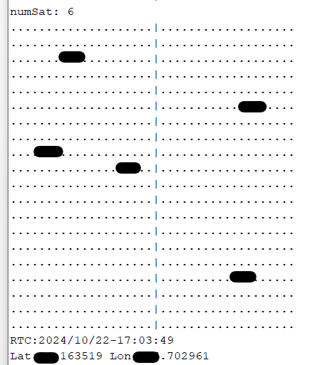

# spreGnssRtcLib

A simple library for using Spresense GNSS and RTC.
## Please be careful when sharing information to protect personal privacy.

## Description

`spreGnssRtcLib` is a library designed for the Spresense platform, enabling users to easily access GNSS positioning data and synchronize the RTC (Real-Time Clock) with satellite time information. This library provides various functions to initialize the GNSS module, retrieve satellite data, check position fix status, and plot satellite positions in a skyplot. With debug options available, it is ideal for developers looking to integrate GNSS capabilities into their Spresense projects.

## Features

- Access GNSS positioning data.
- Synchronize RTC with satellite time.
- Check position fix status.
- Plot satellite positions in a skyplot.
- Debug options for development.


## Installation

You can install the library through the Arduino IDE Library Manager. Follow these steps:

1. Open the Arduino IDE.
2. Go to **Sketch** > **Include Library** > **Manage Libraries**.
3. Search for `spreGnssRtcLib`.
4. Click on the **Install** button.

Alternatively, you can clone the repository and add it manually:

```bash
git clone https://github.com/chrmlinux/spreGnssRtcLib.git
